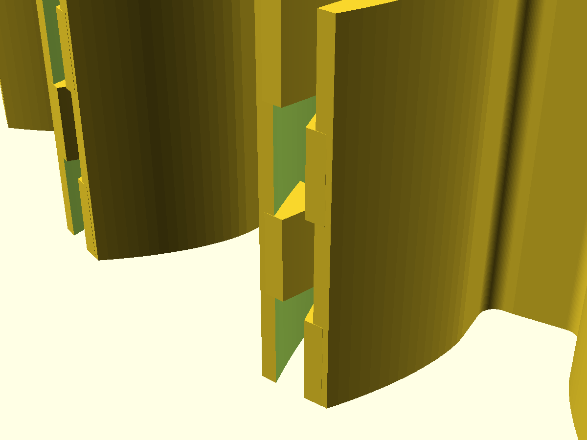
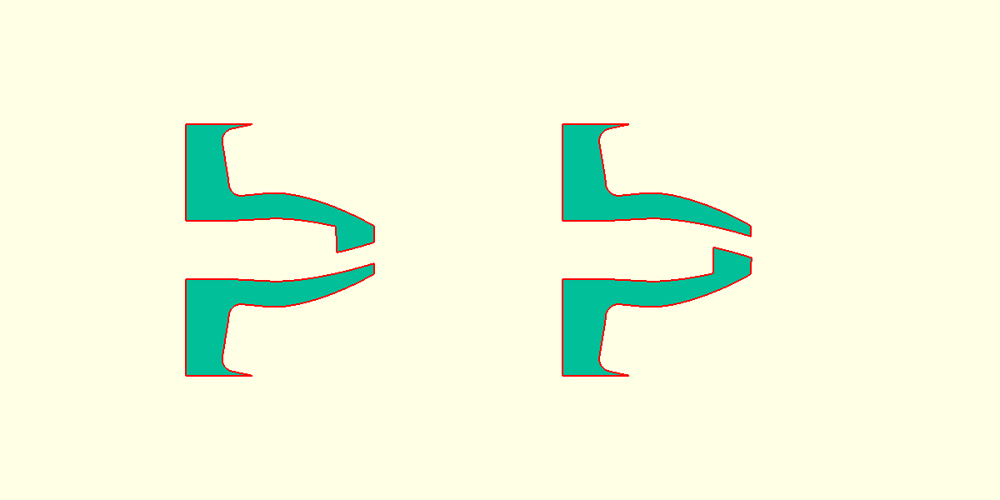

# compliant-spur-gear

A parametric zero-backlash spur gear in OpenSCAD. Instead of a split gear held together by springs, every tooth has spring walls built in.



## How it works

- Each tooth is hollow. Its two flanks are thin cantilever walls rooted in the rim, and both run the full face width.
- The tooth is cut 0.10 mm oversize per flank. When it meshes at the nominal center distance, the mating gear pushes both walls toward the tooth center, which removes backlash.
- The tip is closed by interleaved fingers. Along Z the cap is split into layers, and in each layer one wall sends a finger across the slot.
- When the walls are pushed in, the fingers slide past each other. There is no separate stop: a wall stops when its finger reaches the inside of the opposite wall.

```
developed section through the cap (looking radially):

  z=F  |R wall|<==== R finger ====|  gap  |L wall|
       |R wall|  gap  |==== L finger ====>|L wall|
       |R wall|<==== R finger ====|  gap  |L wall|
  z=0  |R wall|  gap  |==== L finger ====>|L wall|
```



## Files

| File | What it is |
|---|---|
| `compliant_gear.scad` | Parametric model (gear, mating pinion, assembly, sections) |
| `compliant_gear.stl` | Exported gear (default parameters) |
| `pinion.stl` | Plain 16-tooth mating pinion |
| `drawing/compliant-gear-drawing.html` | Engineering drawing sheet (open in a browser) |
| `drawing/gen.py` | Generates the drawing from the same involute math |

## Defaults

Module 3, 20 teeth, 20° pressure angle, 12 mm face width, 8 mm bore. Mates with a 16-tooth pinion at 54.000 mm center distance.

| Parameter | Default | Meaning |
|---|---|---|
| `preload` | 0.10 | Extra flank thickness per side at the pitch circle |
| `hollow_frac` | 0.55 | Slot width as a fraction of tooth width |
| `slot_depth` | 2.0 | How far the slot goes below the root circle |
| `cap_height` | 1.8 | Radial height of the finger cap |
| `cap_layers` | 4 | Number of interleaved finger layers |
| `cap_clearance` | 1.0 | Gap from a finger to the opposite wall, which sets the closing travel |
| `layer_gap` | 0.3 | Z clearance between finger layers |

A rough cantilever estimate for rigid resin (E ≈ 3.5 GPa) is about 75 N/mm per wall. That gives about 7.5 N of preload at mesh, and the fingers make contact after about 0.28 mm of wall travel at the pitch circle. These are first-order numbers, so test before relying on them.

## Building

```sh
openscad -o compliant_gear.stl -D 'show="gear"'   compliant_gear.scad
openscad -o pinion.stl         -D 'show="pinion"' compliant_gear.scad
python3 drawing/gen.py   # regenerate the drawing
```

`show` also accepts `assembly` and `tooth_sections`.

## Printing

The default gaps (0.30 mm between layers, about 0.27 mm finger tips) are meant for SLA, SLS or MJF. For FDM, use a larger module and increase `layer_gap` and `cap_clearance`.

## License

MIT
