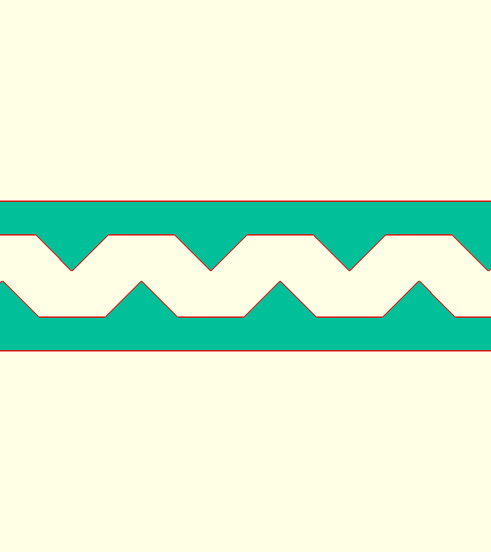

# compliant-spur-gear

A parametric zero-backlash spur gear in OpenSCAD. Instead of a split gear held together by springs, every tooth has spring walls built in.


## How it works

- Each tooth is hollow. Its two flanks are thin cantilever walls rooted in the rim, and both run the full face width.
- The tooth is cut 0.10 mm oversize per flank. When it meshes at the nominal center distance, the mating gear pushes both walls toward the tooth center, which removes backlash.
- The tip is closed by interleaved fingers. Along Z the cap is split into layers, and in each layer one wall sends a finger across the slot.
- When the walls are pushed in, the fingers slide past each other. There is no separate stop: a wall stops when its finger reaches the inside of the opposite wall.

```
developed section through the cap (looking radially):

  z=F  |R wall|<==== R finger ====|  gap  |L wall|
       |R wall|  gap  |==== L finger ====>|L wall|
       |R wall|<==== R finger ====|  gap  |L wall|
  z=0  |R wall|  gap  |==== L finger ====>|L wall|
```


## v2: print-friendly finger cap

`compliant_gear_v2.scad` has the same mechanism, but the fingers are 45° wedges instead of flat layers. When the gear prints flat, each v1 finger has a 90° overhang underneath. In v2 every downward-facing surface of the cap is at 45° (set by `overhang_angle`), so it prints without supports, and there's no thin layer gap to keep open.

In a section through the cap, the wedges form two interleaved rows of triangles, one row rooted in each wall. The tips still stop `cap_clearance` short of the opposite wall. The zig-zag period is chosen so the sloped faces have at least that much clearance (default: 4 L + 4 R wedges, 3.0 mm period).



## Files

| File | What it is |
|---|---|
| `compliant_gear.scad` | Parametric model (gear, mating pinion, assembly, sections) |
| `compliant_gear.stl` | Exported gear (default parameters) |
| `compliant_gear_v2.scad` | v2 model with 45° wedge fingers |
| `compliant_gear_v2.stl` | Exported v2 gear |
| `compliant_gear_v2.step` | v2 as an exact B-rep (STEP), rebuilt in build123d |
| `drawing/v2-views/` | v2 standard views sheet (top / front / right / iso) and its scripts |
| `pinion.stl` | Plain 16-tooth mating pinion |
| `test_stand.scad` / `test_stand.stl` | Two-pillar stand for meshing two 20T gears to test backlash |
| `drawing/compliant-gear-drawing.html` | Engineering drawing sheet (open in a browser) |
| `drawing/gen.py` | Generates the drawing from the same involute math |

## Defaults

Module 3, 20 teeth, 20° pressure angle, 12 mm face width, 8 mm bore. Mates with a 16-tooth pinion at 54.000 mm center distance.

| Parameter | Default | Meaning |
|---|---|---|
| `preload` | 0.10 | Extra flank thickness per side at the pitch circle |
| `hollow_frac` | 0.55 | Slot width as a fraction of tooth width |
| `slot_depth` | 2.0 | How far the slot goes below the root circle |
| `cap_height` | 1.8 | Radial height of the finger cap |
| `cap_layers` | 4 | Number of interleaved finger layers |
| `cap_clearance` | 1.0 | Gap from a finger to the opposite wall, which sets the closing travel |
| `layer_gap` | 0.3 | Z clearance between finger layers |

A rough cantilever estimate for rigid resin (E ≈ 3.5 GPa) is about 75 N/mm per wall. That gives about 7.5 N of preload at mesh, and the fingers make contact after about 0.28 mm of wall travel at the pitch circle. These are first-order numbers, so test before relying on them.

## Building

```sh
openscad -o compliant_gear.stl -D 'show="gear"'   compliant_gear.scad
openscad -o pinion.stl         -D 'show="pinion"' compliant_gear.scad
openscad -o compliant_gear_v2.stl -D 'show="gear"' compliant_gear_v2.scad
python3 drawing/gen.py   # regenerate the drawing
```

`show` also accepts `assembly` and `tooth_sections`.

## Backlash test stand

`test_stand.scad` is a base plate with two pillars for meshing two of the 20-tooth gears. Each pillar has a Ø16 shoulder that the gear's hub sits on, 2 mm above the plate, so the teeth and spring walls never touch the floor. Above the shoulder is a Ø7.70 pin, which leaves 0.15 mm of radial clearance in the Ø8 bore.

The gears preload each other, which pushes them apart against the outer sides of their pins. To compensate, the pins are 2 × 0.15 mm closer than the nominal 60.00 mm center distance, so the gears mesh at exactly 60.00 mm. Set `extra_center_distance` above 0 to open the mesh and make backlash appear.

## Printing

v1's defaults (0.30 mm between layers, about 0.27 mm finger tips) are meant for SLA, SLS or MJF. For FDM, use v2: its cap has no unsupported overhangs. The wedge tips are still fine features, so a larger module helps.

## License

MIT
